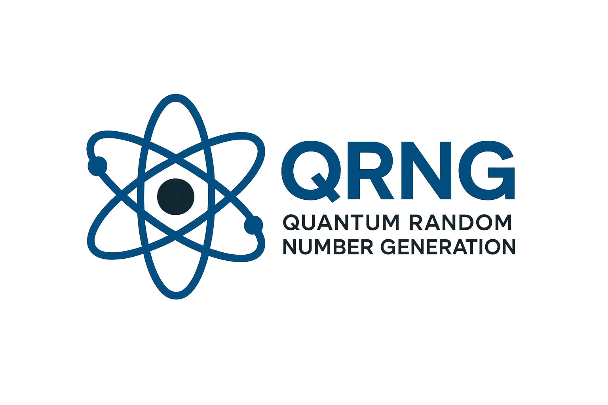
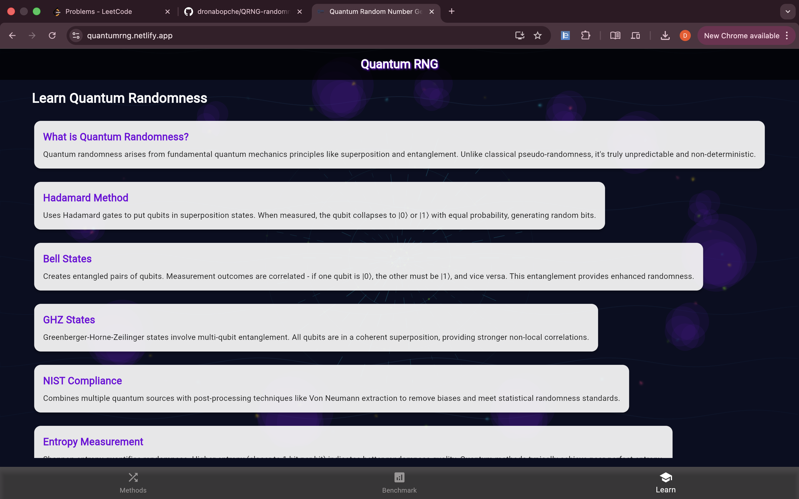
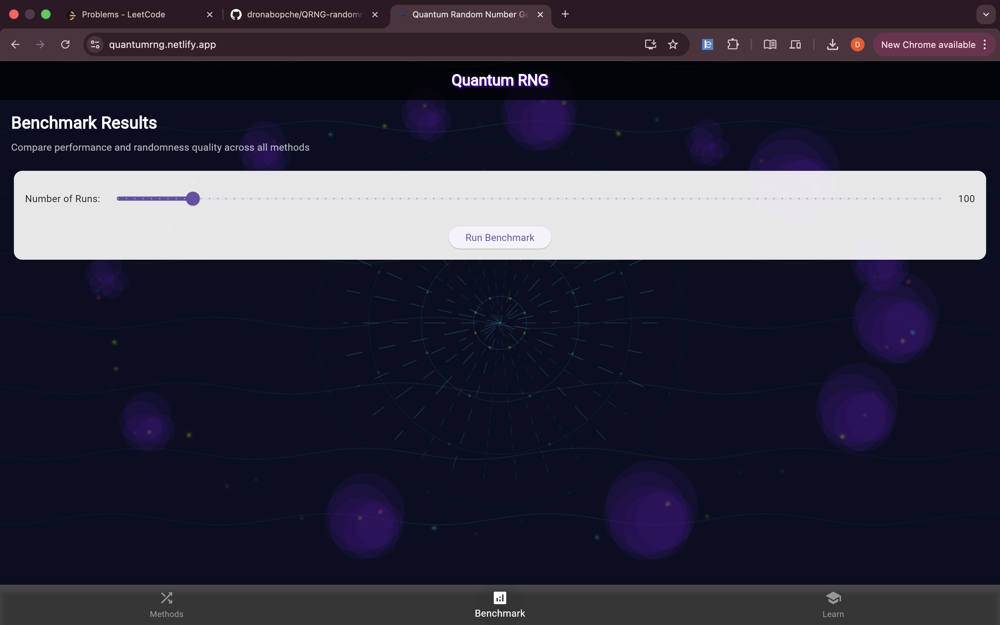
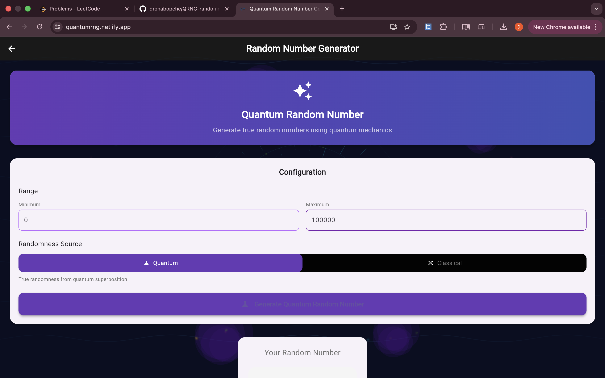
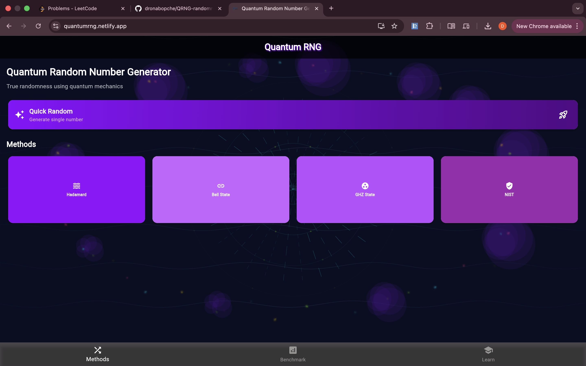

# Quantum Random Number Generator (QRNG) <div align="center">  </div> 

A complete quantum random number generation system with Flutter frontend and Python quantum backend.

## 🏗️ System Architecture

```
Flutter Frontend (UI) → Python Backend (FastAPI) → Quantum Simulation (Qiskit)
```

## 📁 Complete File Structure

```
quantum-rng/
├── frontend/                 # Flutter Application
│   ├── lib/
│   │   ├── main.dart
│   │   ├── methods_overview_page.dart
│   │   └── qrng_quick.dart
│   └── pubspec.yaml
├── backend/                  # Python Quantum Server  
│   ├── app.py
│   ├── quantum_generator.py
│   ├── requirements.txt
│   └── visualizations/
└── README.md
```

## 🔧 Step-by-Step Installation & Setup

### Phase 1: Python Backend Setup

#### Step 1.1 - Create Python Environment
```bash
python -m venv quantum_env
source quantum_env/bin/activate  # Linux/macOS
quantum_env\Scripts\activate    # Windows
```

#### Step 1.2 - Install Python Dependencies
```bash
cd backend
pip install -r requirements.txt
```

**Python Packages Installed:**
- `fastapi` - Web server framework
- `uvicorn` - ASGI server
- `qiskit` - Quantum computing framework
- `qiskit-aer` - Quantum simulator
- `matplotlib` - Visualization library
- `seaborn` - Statistical visualizations
- `numpy` - Numerical computing
- `pandas` - Data analysis

#### Step 1.3 - Start Quantum Backend Server
```bash
cd backend
uvicorn app:app --reload --host 0.0.0.0 --port 5000
```
**Server runs at:** `http://localhost:5000`

### Phase 2: Flutter Frontend Setup

#### Step 2.1 - Install Flutter SDK
```bash
# macOS
brew install --cask flutter

# Windows
# Download from flutter.dev

# Linux
sudo snap install flutter --classic
```

#### Step 2.2 - Verify Installation
```bash
flutter doctor
flutter config --enable-web
```

#### Step 2.3 - Install Flutter Dependencies
```bash
cd frontend
flutter pub get
```

**Flutter Dependencies:**
- `http` - API calls to Python backend
- `provider` - State management

#### Step 2.4 - Run Flutter Application
```bash
flutter run -d chrome
```
**App runs at:** `http://localhost:5000`

## 🎯 Quantum Methods Implemented

### 1. Hadamard Method
- **Quantum Process**: Applies Hadamard gates to create superposition
- **Qiskit Implementation**: `qc.h(i)` on all qubits
- **Parameters**: Shots (100-10,000), Qubits (1-8)
- **Output**: True quantum random bits

<div align="center">  </div> 

### 2. Bell State Method  
- **Quantum Process**: Creates entangled qubit pairs using H + CNOT gates
- **Qiskit Implementation**: `qc.h(0)` + `qc.cx(0,1)`
- **Fixed**: 2 qubits only (for perfect entanglement)
- **Output**: Correlated random bits
  
<div align="center">  </div> 

### 3. GHZ State Method
- **Quantum Process**: Multi-qubit entanglement
- **Qiskit Implementation**: Cascaded CNOT gates
- **Parameters**: Shots, Qubits (1-8)
- **Output**: Multi-party correlated randomness

<div align="center">  </div> 

### 4. NIST Compliant Method
- **Process**: Quantum source + cryptographic post-processing
- **Implementation**: Hadamard + von Neumann extraction
- **Standards**: NIST SP 800-22 compliant
- **Output**: Cryptographically secure random numbers

  <div align="center">  </div> 

## 🔬 Quantum Visualization Features

### Python Backend Visualizations:
1. **Probability Distribution Charts** - Matplotlib/Seaborn
2. **Quantum Circuit Diagrams** - Qiskit visualization
3. **Entropy Analysis Plots** - Statistical randomness tests
4. **Bit Distribution Graphs** - Visual randomness verification

### Flutter Frontend Displays:
1. **Real-time Results** - Entropy, total bits, generation time
2. **Sample Random Bits** - First 20 bits preview
3. **Visualization Images** - Rendered quantum charts
4. **Method Statistics** - Performance metrics

## 🚀 Running the Complete System

### Start Backend (Terminal 1):
```bash
cd backend
source quantum_env/bin/activate
uvicorn app:app --reload --port 5000
```

### Start Frontend (Terminal 2):
```bash
cd frontend
flutter run -d chrome
```

### Access Points:
- **Flutter App**: `http://localhost:5000`
- **API Documentation**: `http://localhost:5000/docs`

## 📊 Technical Stack

### Backend (Python):
- **Framework**: FastAPI
- **Quantum**: Qiskit + Aer simulator
- **Visualization**: Matplotlib + Seaborn
- **Data Processing**: NumPy + Pandas

### Frontend (Flutter):
- **HTTP Client**: http package for API calls
- **State Management**: Provider pattern
- **UI Framework**: Material Design
- **Platform**: Web, Mobile, Desktop

## 🧪 Testing the System

### 1. Test Quantum Backend:
```bash
# Test API endpoint
curl -X POST "http://localhost:5000/api/generate/hadamard" \
  -H "Content-Type: application/json" \
  -d '{"shots": 100, "qubits": 2}'
```

### 2. Test Flutter Frontend:
- Open `http://localhost:5000`
- Select any quantum method
- Adjust parameters and generate
- View real quantum randomness

## 🔍 Verification Methods

### Quantum Randomness Verification:
1. **Entropy Calculation** - Measures randomness quality (0-1.0)
2. **Bit Distribution** - Checks equal 0/1 distribution
3. **Visual Patterns** - No visible patterns in generated bits
4. **Statistical Tests** - NIST test suite compliance

## 🛠️ Development Workflow

### 1. Backend Development:
- Modify `quantum_generator.py` for new quantum methods
- Add visualizations in Python
- Test API endpoints independently

### 2. Frontend Development:
- Update Flutter UI in `methods_overview_page.dart`
- Add new features in `qrng_quick.dart`
- Test with running backend

### 3. Integration Testing:
- Verify API communication
- Test error handling
- Validate visualization rendering

## 📈 Performance Metrics

- **Quantum Generation**: ~100-500ms per 1000 shots
- **API Response Time**: < 1 second
- **Visualization Generation**: ~200ms
- **Frontend Loading**: < 3 seconds

This system provides a complete quantum random number generation pipeline from quantum simulation to beautiful user interface, all using open-source technologies.
